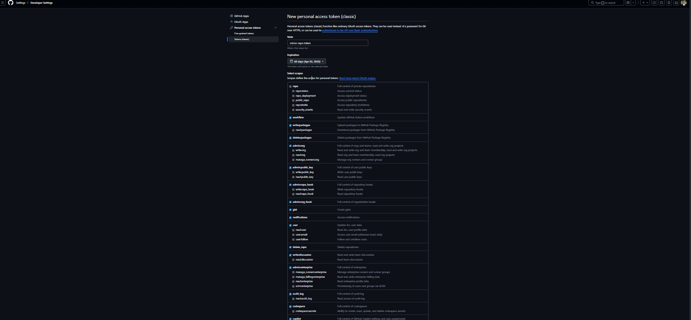
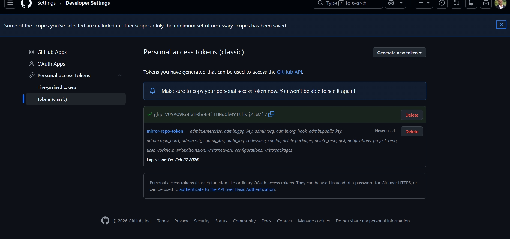

## Repository Mirroring Between GitHub and GitLab

### Introduction :

This project demonstrates repository mirroring between GitHub and GitLab.
Code pushed from the local machine to GitLab is automatically mirrored to GitHub.
This ensures code consistency, backup, and a professional Git workflow.

*   Backup repositories
*   Multi-platform availability
*   Professional Git workflows

#### Architecture Diagram :

##### Tools and Platforms Used:

* Local Machine (Windows OS)

* Git Bash (for Git commands)

* Visual Studio Code (code editor)

* GitHub (remote repository)

* GitLab (remote repository with mirroring )

### Step-by-Step Project Explanation:
#### Step 1: Create a Repository on GitHub

* Login to GitHub

* Click on New Repository

* Enter the repository name

* Create the repository

#### Step 2: Create a Repository on GitLab

* Login to GitLab

* Click on New Project / Repository

* Enter the same repository name

* Create the repository

#### Step 3: Configure Repository Mirroring in GitLab

* Open the GitLab repository

* Go to Settings → Repository

* Scroll to Mirroring repositories

* Click on Add new

* Paste the GitHub repository HTTPS URL

* Save the configuration

#### Step 4: Generate GitHub Personal Access Token

**Authentication is required to push code from GitLab to GitHub:**

* Go to GitHub Settings → Developer settings

* Open Personal access tokens

* Generate a new token (Classic)

* Provide a token name and expiry date

* Select required permissions

* Generate and copy the token

#### Step 5: Clone Repository to Local Machine:

You can clone either GitHub or GitLab repository

#### Step 7: Create or Modify Files Locally:

Files such as index.html or README.md are created or modified.
After making changes, the code is staged and committed:

* git  add .
* git commit -m "added index.html"

#### Step 8: Push Code to GitLab

**The committed code is pushed to GitLab:**

* git push -u origin main

Once the push is successful, GitLab automatically mirrors the same changes to GitHub.

#### **Summary:**

This project demonstrates how repository mirroring works between GitHub and GitLab. The developer writes and updates code on a local machine, pushes it to GitLab, and GitLab mirrors the same code to GitHub automatically.

**This setup:**

* Keeps code synchronized across platforms

* Provides an additional backup of the repository

* Follows real-world DevOps and Git workflows

Overall, this project is a practical example of how professional teams manage and secure their source code using multiple Git platforms.